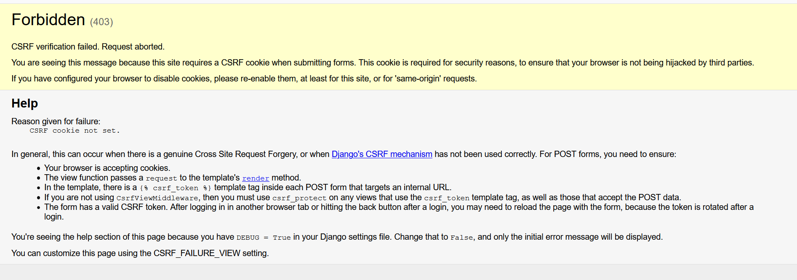

# Django template reconstruction

> code tags: \*chapter4.x

## template in django
1. create folder lists/templates
2. create file home.html in folder templates created above
3. add lists to var `INSTALLED_APPS` in setting.py
```C
INSTALLED_APPS = [
    'django.contrib.admin',
    .....
    'lists'
]
 
```

## 保存用户输入，测试数据库
* 编写表单，发送post请求
  1. 给\<input\>元素指定name=属性
  2. 把它放在<form>标签中，并为标签指定method="post"属性

* 这时跑function_test会报错误
```
selenium.common.exceptions.NoSuchElementException: Message: Unable to locate element: [id="id_list_table"]
```
* fix `CSRF\(Cross-Site Request Forgery\)`
   + 错误信息
   
   + Django 针对CSRF保护措施是在每个生成的表单中放置自动生成的令牌，使用模板标签(template tag)
     + syntax: 
     + example:
     ```
     <form method="POST">
       <input name="item_text" id="id_new_item" placeholder="Enter a to-do item">
       
     </form>
     ```
 ## 在服务器中处理post 请求
> **代码名言**
> * 遇红/变绿/重构，
>   1. 写单元测试(遇红)
>   2. 编写尽可能简单的代码使测试通过(变绿)
>   3. (重构)，改进代码，使其合理
> * 三角法
>   + 如果编写无法让你满意的作弊代码就能让测试通过，就再写一个测试
> * 事不过三，三则重构
>   + 如果代码里有三块代码块重复，就应该重新写。去除重复。
### Django ORM
> * ORM(Object Relational Mapper)是一个数据抽象层，描述存储再数据库中的表，列，行。在ORM概念中：
>    + `类`对应数据库的`表`
>    + `属性`对应数据库的`列`
>    + `实例`对应数据库的`行`

> `tag v1_chapter4.5` 增加ORM相关代码
>  * with error : **django.db.utils.OperationalError: no such table: lists_item**

### 第一个数据库迁移
* 创建迁移
  + 名令：
  ```C
  python .\manage.py makemigrations
  ```
### 新迁移
```
XXXX\superlists> python .\manage.py makemigrations
You are trying to add a non-nullable field 'text' to item without a default; we can't do that (the database needs something to populate existing rows).
Please select a fix:
 1) Provide a one-off default now (will be set on all existing rows with a null value for this column)
 2) Quit, and let me add a default in models.py
```
> git tag `v1_chapter4.6`

### 把post请求中的数据存入数据库
修改View.py 完成Item create

### 处理完POST请求后重定向
 * save post
 * redirect

 * display all item
 ```
        <table id="id_list_table">
            
            <tr><td>1: {{item.text}} </td></tr>
            
        </table>
 ```

